# User manual — pdfcodes preview

This manual explains, step by step, how to use the application to arrange
codes (text) on a background and generate PDFs ready for **print** and for
**contour cutting**.

> Note: the screenshots below currently show the Romanian version of the
> interface. The layout and controls are identical in the English build — only
> the text differs.

---

## 1. What the application does

- You place one or more **codes** (text) over a **background** (a card).
- You cut the card along a **contour** — a shape from a file (**PDF or SVG**) or
  a **preset shape** (circle, rounded rectangle, etc.).
- You see **in real time** how the cards will look, in a preview.
- The codes (the data) can be **generated automatically** or loaded from your
  own **CSV** file.
- At the end you get one or two PDFs:
  - **Print** — the cards with background and text, laid out (imposed) on the page.
  - **Contour** — the cutting lines (for a plotter/cutter).

All colors are in **CMYK** (as printed), and the on-screen preview is an RGB
approximation of the print color.

---

## 2. The interface at a glance

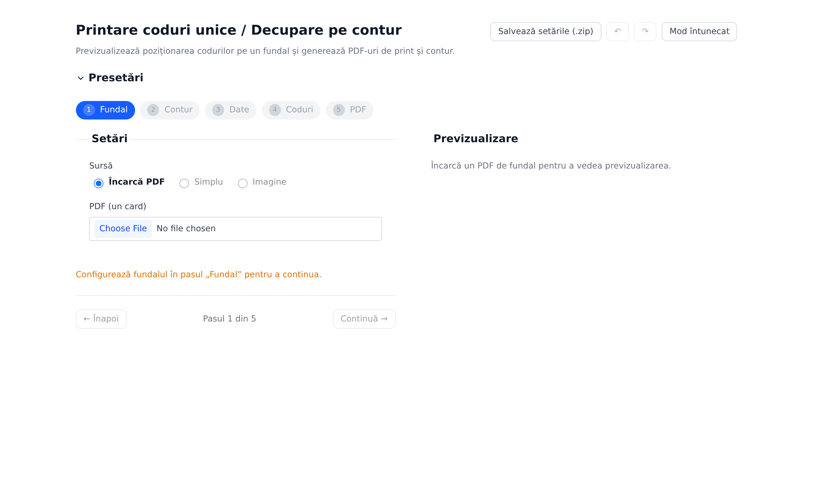

The screen has two columns:

- **Left** — the configuration panel (changes depending on the current step).
- **Right** — the card **Preview** and, after generating, the **Result**.

At the top, in the header, you find:

- The application title.
- **Save settings (.zip)** — downloads all your choices (see 2.2).
- The **↶ / ↷** buttons — **Undo / Redo** (equivalent to Ctrl+Z / Ctrl+Shift+Z).
- The **"Light mode" / "Dark mode"** button — switches the visual theme.

### 2.1 The steps (the wizard)

Below the "Presets" section there is a bar with **5 steps**, which must be
completed in order:

1. **Background** — the card's background (PDF, plain color or generated image).
2. **Contour** — the cutting shape (PDF/SVG file or preset shape).
3. **Data** — the source of the codes (generated automatically or from a CSV).
4. **Codes** — the appearance and placement of the text on the card.
5. **PDF** — generating the print and contour PDFs.

The steps **unlock one at a time**:

- **Background** is always available.
- **Contour** unlocks after you have configured the background.
- **Data** unlocks after the background **and** the contour.
- **Codes** and **PDF** unlock once the data is prepared too.

If a step is locked, a message appears telling you what is still left to do.
At the bottom you find the **Back / Continue** navigation buttons and the
"Step X of 5" indicator.

### 2.2 Presets (saving and loading)

- **Save settings (.zip)** — button in the **header** (top), next to the
  undo/redo buttons. Downloads a `.zip` file with **all** your choices, including
  the background, the contour and the fonts used, plus a `thumbnail.png` of the
  preview (when one exists). Useful for resuming work later or on another
  computer.
- The **"Presets"** section (collapsible, at the top) — **Load settings (.zip or
  .json)** reloads a previously saved configuration.

---

## 3. Step 1 — Background

Here you set the **card's background** — the image (or color) that gets printed
and on which you will place the codes. The step is complete once a valid
background exists; **the cutting shape is set separately, in Step 2 — Contour.**

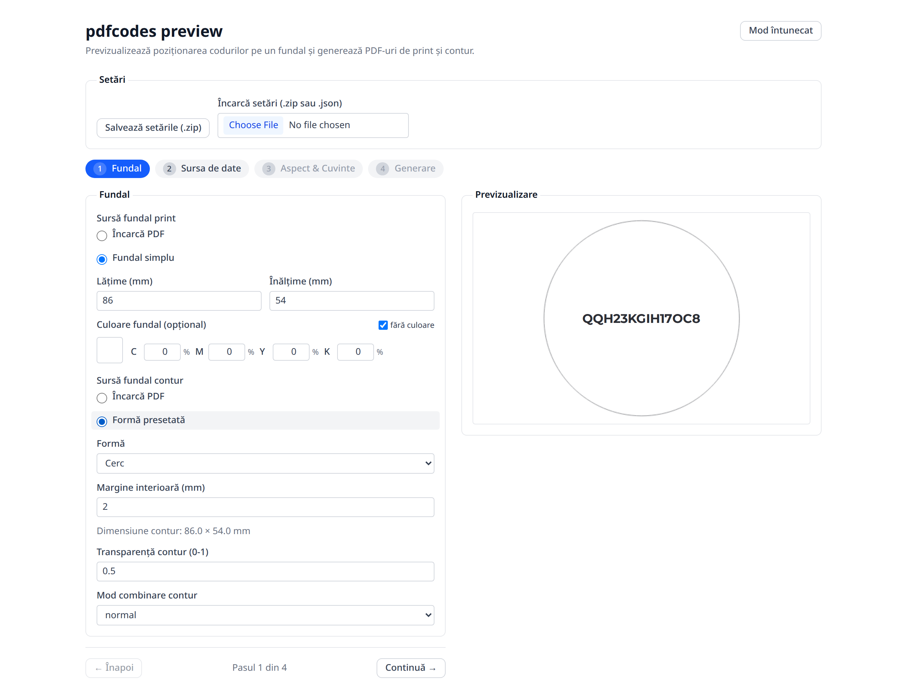

*The "Background" screen: left — configuring the background; right — the card
preview. At the top you can see the header, the 5-step bar and the "Presets"
section.*

The first switch, **Source**, chooses where the card comes from. There are three
variants — **Upload PDF**, **Simple** and **Image** — and different fields appear
below it depending on the choice.

### 3.1 Upload PDF

You use a ready-made PDF that contains **a single card** (not a whole sheet).

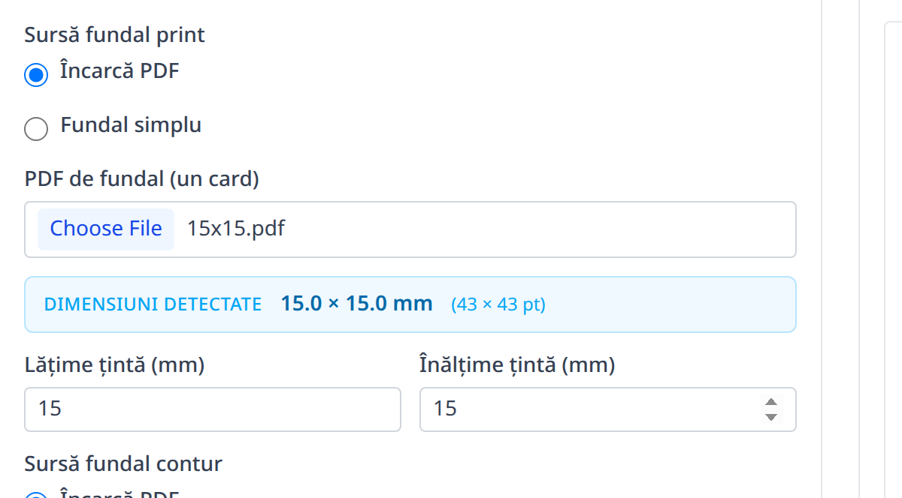

- **PDF (one card)** — the **"Choose File"** button opens the file picker.
  If the PDF has several pages, the **Page (1–N)** field appears next to it (on
  the same row) to choose the page used.
- **Detected dimensions** — the blue strip shown as soon as the PDF is read.
  It shows the real page size in **mm** (and, in parentheses, in **typographic
  points — pt**). It is informational; you cannot edit it.
- **Target width (mm)** / **Target height (mm)** — optional. Pre-filled with the
  detected size; you can change them to **resize** the card. The **padlock**
  button keeps the proportion, and the **arrows** button swaps the width and the
  height (portrait ⇄ landscape). Codes already placed keep their **relative**
  position, so they don't need rearranging.
- **↻ Rotate 90°** — rotates the background by 90° (the **"Rotation: …°"**
  indicator shows the current angle).
- **Mirror X** / **Mirror Y** — flips the background horizontally / vertically.

### 3.2 Simple

You generate the card directly in the application, without a PDF — useful for a
plain colored or transparent rectangle.

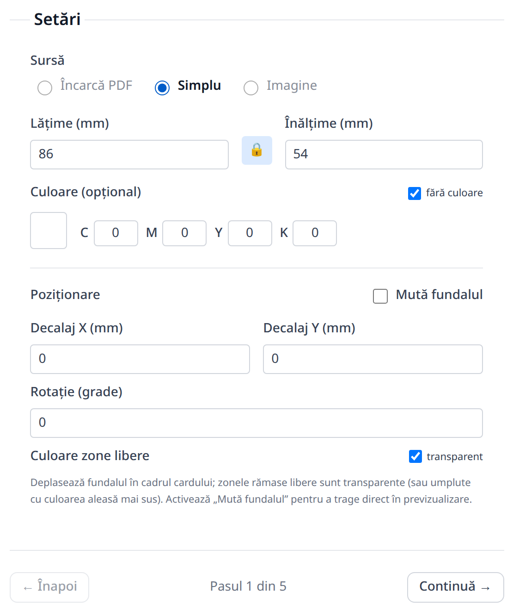

- **Width (mm)** / **Height (mm)** — the dimensions of the generated card (with
  the proportion padlock next to them).
- **Color (optional)** — the fill color, in **CMYK** (see section **6.4** for how
  to use the picker).
  - Tick **"no color"** (top-right corner) for a card with **no fill** —
    transparent. While it is ticked, the CMYK fields disappear.

### 3.3 Image

You build the background from an **image** (PNG, JPEG or SVG), which is stretched
over the card at the target dimensions.

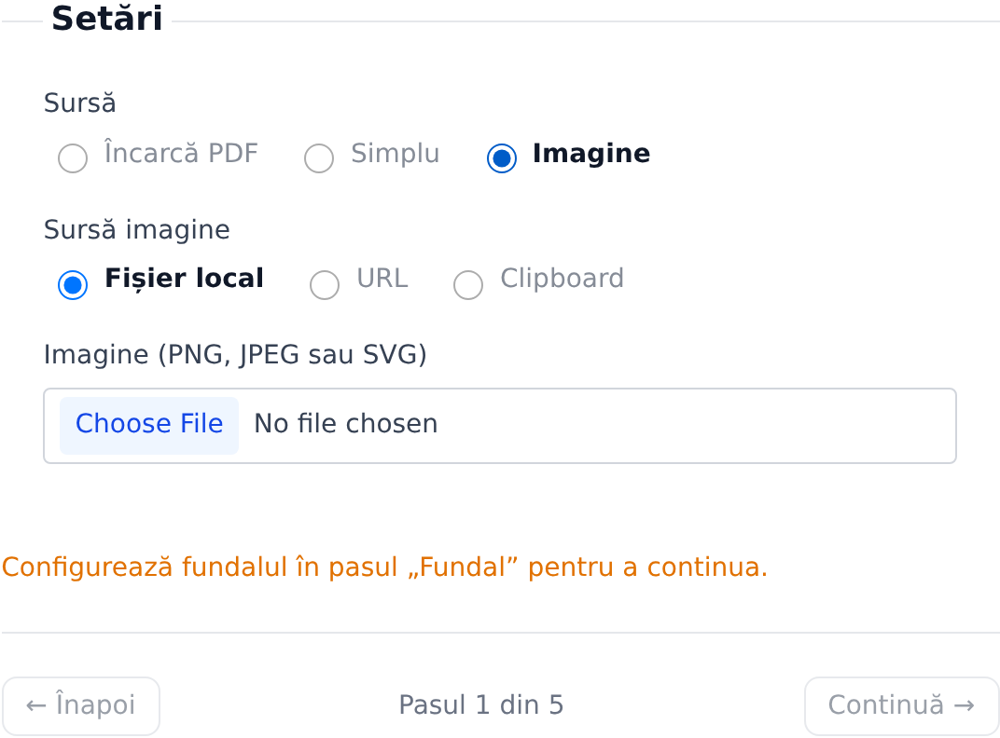

- **Image source** — where the image comes from:
  - **Local file** — the **Image (PNG, JPEG or SVG)** field opens the file
    picker.
  - **URL** — you paste an address and press **"Load"**.
  - **Clipboard** — you press **"📋 Paste the image"**, `Ctrl+V`, or drag an
    image into the dotted area.
- For an **SVG with text** a warning appears: convert the text to outlines
  before uploading.
- After loading, **Target width (mm)** / **Target height (mm)** appear (with
  padlock and swap), plus **↻ Rotate 90°** and **Mirror X/Y**, just like for a
  PDF. The fields start from the image's own size: for an **SVG**, the file's
  real physical size; for a **PNG/JPEG**, the pixel size read at **150 dpi**
  (the minimum resolution for a good-quality print) — you can then edit them
  freely. If the image has transparent areas, **Color of transparent areas** also
  appears (choose a fill color, or "checkerboard" to keep the transparency).

### 3.4 Positioning (common to all sources)

Once a background exists, the **Positioning** block appears at the bottom. It
affects **only the background** (not the cutting shape):

- **Move the background** — enables dragging the background directly in the
  preview (**Shift + drag** locks the movement to a single axis).
- **Offset X (mm)** / **Offset Y (mm)** — moves the background within the card.
- **Rotation (degrees)** — finely rotates the background (any angle, not just 90°).
- **Color of vacated areas** — the color that fills the areas left empty after
  moving/rotating; **"transparent"** leaves them empty.

> The contour (the cutting shape) is no longer configured here, but in **Step 2 —
> Contour** (the next section).

---

## 4. Step 2 — Contour

Here you set the **contour** — the line along which the card is cut (for a
plotter/cutter). The step is complete once a valid contour exists. The contour
can come from your own **file** or from a **preset shape**.

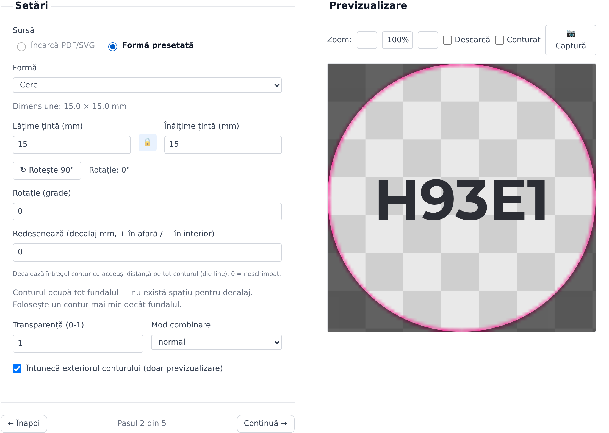

*The "Contour" screen: the cutting shape (here a circle) appears over the card in
the preview; "Dim the contour's exterior" fades the area that gets discarded.*

The first switch, **Source**, chooses between **Upload PDF/SVG/PNG** and **Preset
shape**.

### 4.1 Upload PDF/SVG/PNG

You use your own cutting line from a **PDF** or **SVG** file, or you let it be
**traced automatically** from a **transparent image** (**PNG** or **JPEG**).

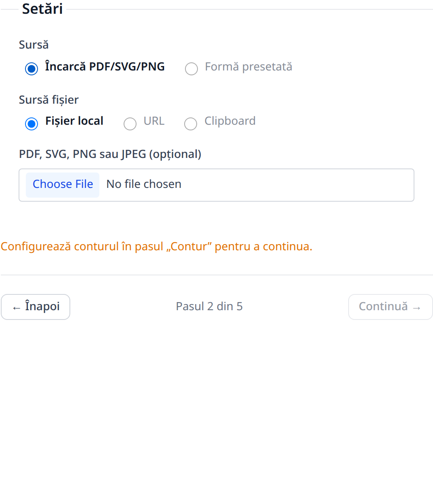

- **File source** — where the file comes from:
  - **Local file** — the **PDF, SVG, PNG or JPEG (optional)** field opens the
    file picker. If the PDF has several pages, **Page (1–N)** appears next to it
    (on the same row). When you reuse the background's PDF, the application
    automatically picks a **different page** than the background's and tells you:
    *"The app automatically uses page X of Y (different from the background's
    page)."* — the note disappears as soon as you pick the page yourself.
  - **URL** — you paste an address and press **"Load"**.
  - **Clipboard** — you press **"📋 Paste the file"**, `Ctrl+V`, or drag a
    PDF/SVG/PNG/JPEG file (or SVG code, or an image) into the dotted area.
- For an **SVG with text** a warning appears: convert the text to outlines
  before uploading.
- **Size of the artwork (not the page)** — tick it so the size is the drawing's,
  ignoring the empty margins of the page. Align the cut to the print carefully (a
  warning is shown while it is active). *(PDF/SVG only — for a traced image the
  contour is already the drawing's size.)*

#### Tracing from an image (PNG/JPEG)

When you upload a **transparent image**, the application **automatically traces**
the cutting line along the **outer edge** of the visible pixels — exactly where
the transparency begins. **Transparent areas inside** become **holes** (they get
cut too). Useful for **die-cut stickers**: you provide the artwork as an image and
get the cutting contour that follows it. The **"Trace from image"** group appears
with:

- **Transparency threshold (0–255)** — how opaque a pixel must be to count as
  "solid" (the contour's edge). A lower threshold also catches semi-transparent
  areas; a higher one ignores them.
- **Contour smoothing** — how much the line is smoothed (gets rid of the pixel
  "stairs"). Small values = a line more faithful to the pixels; large values = a
  smoother line.

Both controls **re-trace** the contour in place, without losing your size or
rotation. If the image **has no transparency**, a message appears and the contour
becomes the image's rectangle. For **bleed** (a line slightly outside the
drawing), use **Redraw (+mm)** from the controls below (4.3).

### 4.2 Preset shape

The application draws the contour by itself, based on the card's dimensions.

- **Shape** — the list of shapes: **Circle**, **Ellipse**, **Rectangle**,
  **Rectangle with rounded corners**, **Rectangle with beveled corners**,
  **Heart** and **Polygon**. Depending on the shape, extra fields appear:
  - **Rectangle with rounded corners** — **Corner radius (mm)** and
    **Orientation** (**Outward** = normal rounded corners / **Inward** =
    "scalloped" corners).
  - **Rectangle with beveled corners** — **Corner bevel (mm)** (the corner cut
    straight).
  - **Polygon** — **Number of sides** and the **Star (points inward)** option.
    When **Star** is ticked, two extra controls appear:
    - **Point depth (0.05–0.95)** — how deep the star's notches go, as a fraction
      of the outer radius. Smaller values = longer, sharper points; larger = a
      "fuller" star. By default it automatically follows the number of sides.
    - **Resize only the tips** — when ticked, resizing the contour moves **only
      the outer tips**; the core (the inner ring) stays at the size it had when
      you ticked the option. This lets you make the star sharper by enlarging it
      or blunter by shrinking it, without scaling the whole drawing.
- The preset shape needs a background with known dimensions; otherwise the
  message *"Upload the background PDF first to generate the shape."* appears.

### 4.3 Contour controls (common to both sources)

Once the contour exists, controls appear that apply to both an uploaded file and
a preset shape:

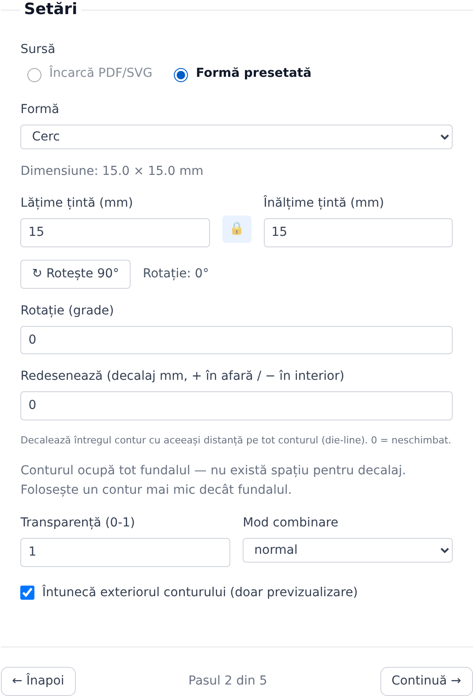

- **Size** — the contour's current size (informational, in mm).
- **Target width (mm)** / **Target height (mm)** — resizes the contour (with the
  proportion **padlock** and the width ⇄ height **swap** button). A circle stays
  1:1.
- **↻ Rotate 90°** (with the **"Rotation: …°"** indicator) — rotates the contour
  by 90°.
- **Rotation (degrees)** — fine rotation, at any angle.
- **Redraw (offset mm, + outward / − inward)** — offsets the **whole cutting
  line** (die-line) by the same distance: positive grows it (bleed), negative
  shrinks it (safety margin). `0` = unchanged. At a non-zero offset, right under
  this control the result is shown, emphasised: *"→ Final cut: W × H mm"*. The
  "Target width/height" fields above remain the **base contour** (without the
  offset), and a note below them reminds you of that: *"The dimensions above are
  the base contour; the redraw (+X mm) produces the final cut below."* — so the
  two numbers don't read as a mismatch.
- **No self-intersection** — appears for a **contour traced from an image** or
  when **Redraw** is active. Tick it so the cutting path does not
  **self-intersect** (you cannot physically cut a line that overlaps itself): the
  application removes the nodes that produce the crossings, keeping the shape
  simple. Especially useful for a large inward offset or shapes with concavities.
- **Offset X / Offset Y** — positions the contour within the card; each field's
  label shows the allowed range (e.g. *"Offset X (0.0–12.5 mm)"*). Next to them,
  the **Center: ↔ Horizontal / ↕ Vertical** buttons. They only appear when the
  contour is smaller than the background; otherwise a message says the contour
  fills the whole background.
- The contour can also be moved **directly in the preview**, just like a code
  (see 6.3): **clicking** it selects it (an animated "marching ants" frame),
  **dragging** moves it, **Shift + drag** locks the movement to a single axis,
  and the **arrow keys** (← ↑ → ↓) nudge it finely while the preview has focus.
- **Opacity (0-1)** and **Blend mode** — how visible the contour is over the
  background in the preview, and the blending mode (`normal`, `multiply`,
  `screen`, `overlay`, etc.). They affect **only the preview**.
- **Dim the contour's exterior (preview only)** — fades the area outside the cut,
  so you can see what the contour keeps. It does not change the cutting file.
- **Pulse the contour (preview only)** — animates a bright outline around the
  cutting line, so you can find it easily on a busy background. It is only a
  visual aid: it does not change the cutting file and does not appear in captures.

---

## 5. Step 3 — Data

Here you set the **codes** that will appear on the cards. **Each row = one card.**
The "Data" step is also a gate: the **Codes** and **PDF** steps stay locked until
the data is ready (see 5.4).

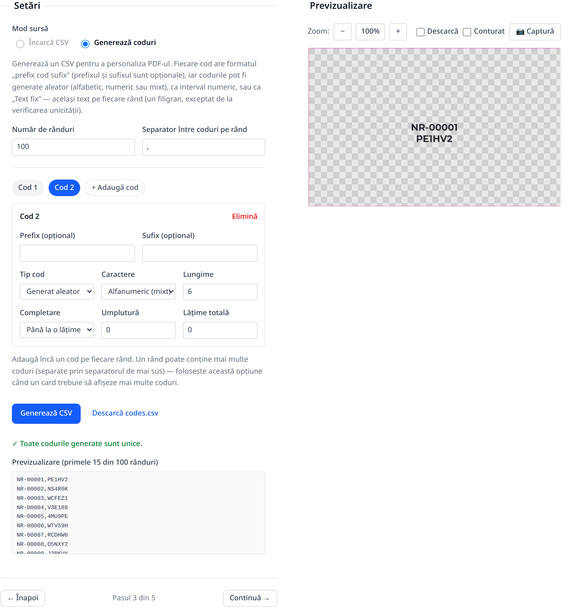

*The "Generate codes" mode: you set the number of rows and the code's structure,
press "Generate CSV", then see a preview of the first rows (and can download
`codes.csv`).*

The first switch, **Source mode**, chooses where the codes come from:

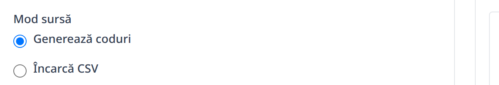

- **Upload CSV** — you use your own CSV file (see 5.2).
- **Generate codes** — the application creates the CSV following your rules (see
  5.1). This is the option selected by default.

### 5.1 Generate codes

#### 5.1.1 General settings

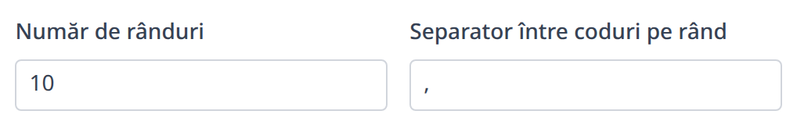

- **Number of rows** — how many cards are generated (one row = one card).
- **Separator between codes on a row** — the character that separates the codes
  on the **same** row. It only matters if a card displays several codes (see
  5.1.4). The default is the comma `,`; you can use a space, `;`, `|`, etc.

#### 5.1.2 The "Code" block — the structure of a code

The codes of a row appear as round **tabs** ("Code 1", "Code 2", …), followed by
the **"+ Add code"** button. Click a tab to open its settings — a single code is
edited at a time. Each code is built following the pattern **prefix + code +
suffix**:

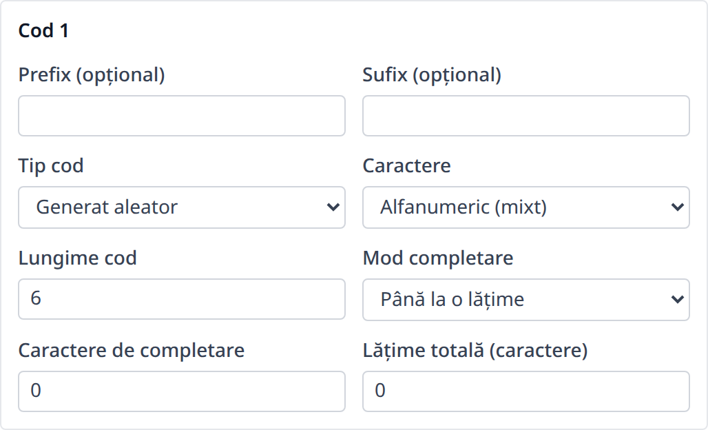

- **Prefix (optional)** / **Suffix (optional)** — fixed text added **before** /
  **after** the code, attached directly (no space — if you want a space, include
  it yourself in the prefix/suffix).
- **Code type** — chooses how the variable part of the code is produced:
  - **Randomly generated** — shows **Characters** (the symbol set: `Numeric`,
    `Alphabetic` or `Alphanumeric (mixed)`) and **Length** (how many characters
    it has).
  - **Numeric range** — shows **Range start** and **Step**: the codes are
    consecutive numbers (e.g. start `1`, step `1` → 1, 2, 3 …).
  - **Fixed text** — shows **Text**: the same text on every row (e.g.
    `SPECIMEN`) — useful as a label or watermark. It has no padding and is
    exempt from the uniqueness check (see 5.1.5).

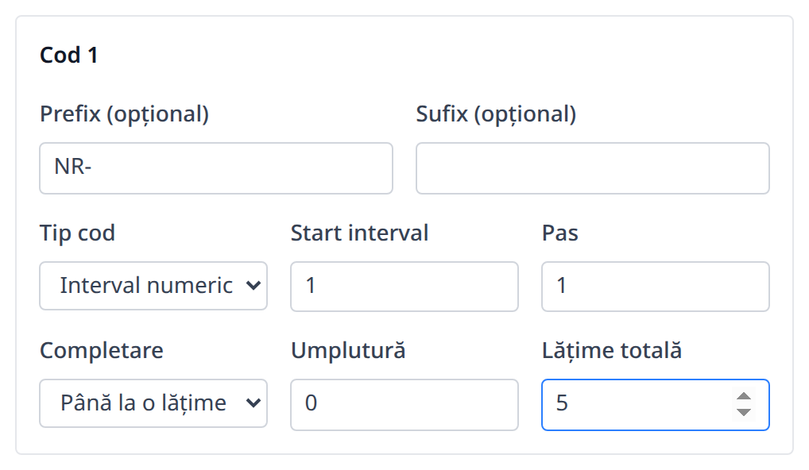

#### 5.1.3 Padding

Padding aligns the codes to a fixed length (useful so they all look the same,
e.g. `00001`, `00002`). It only appears for **Randomly generated** and **Numeric
range** — a "Fixed text" is not padded.

- **Padding**:
  - **Up to a width** — pads the code with the pad characters up to **Total
    width**. E.g.: code `7` + pad `0` + width `5` → `00007`.
  - **Fixed text appended** — simply prepends the pad characters, without a
    target width.
- **Pad text** — the character used for padding (usually `0`).
- **Total width** — only appears for "Up to a width".

> Note: if the total width is **less than or equal to** the code's length, the
> padding has no effect and a yellow warning appears:

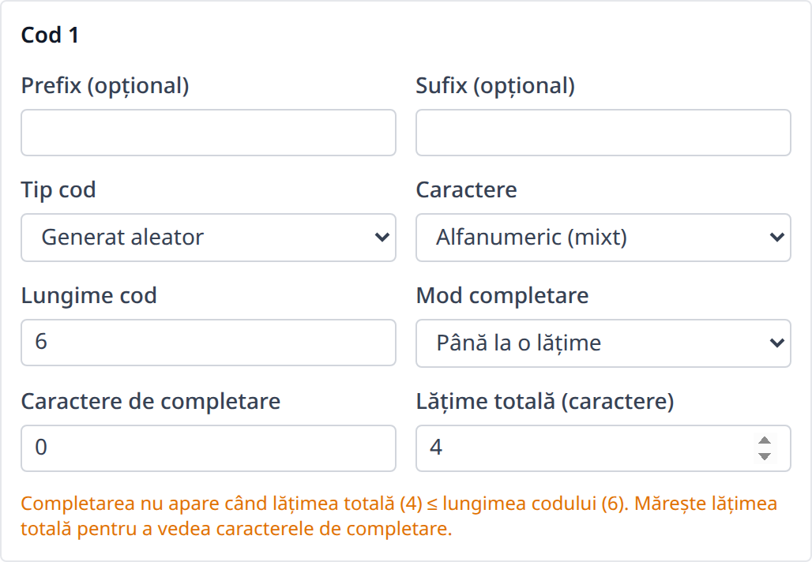

#### 5.1.4 Several codes per row

The **"+ Add code"** button adds a new tab, so **each card will display several
codes**, separated by the separator from 5.1.1. When there are at least two
codes, the active block has a **"Remove"** button that deletes it.

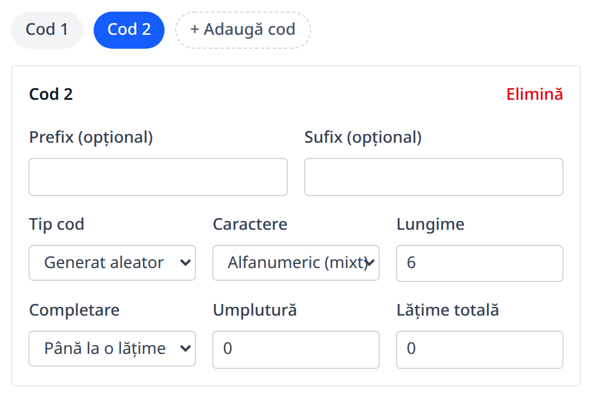

#### 5.1.5 Code uniqueness

For **randomly generated** codes, the application compares the requested number
of rows with the number of **possible combinations** (given by the character set
and the length):

- If the rows **approach** the number of combinations, a **yellow** warning
  appears: random codes do not guarantee uniqueness, so at this volume duplicates
  will likely appear.
- If the rows **exceed** the combinations, the message turns **red**, the code's
  tab gets the **⚠** mark, and the "Generate CSV" button is **disabled**.
  Increase the code length, change the character set or use a numeric range.

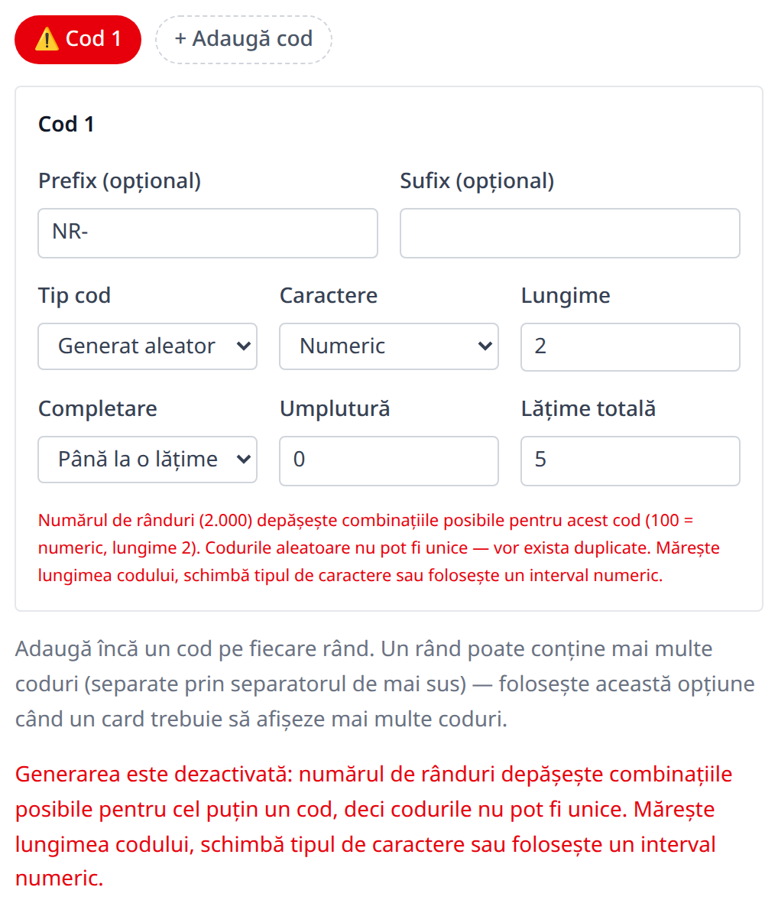

After generating, a summary appears under the button: **"✓ All generated codes
are unique."** (green) or **"⚠ N duplicate codes …"** (yellow), when not enough
unique codes could be generated.

#### 5.1.6 Generating

- **Generate CSV** — produces the data. For large batches, the button shows the
  progress (`Generating… 1,234 / 250,000`).
- **Download codes.csv** — appears next to the button after generating; downloads
  the file.

> Important: if you change the rows, the codes or the separator **after**
> generating, *"The settings have changed. Regenerate the CSV to continue."*
> appears — press **"Generate CSV"** again to be able to move on.

### 5.2 Upload CSV

You use a ready-made CSV file. Each row becomes a card.

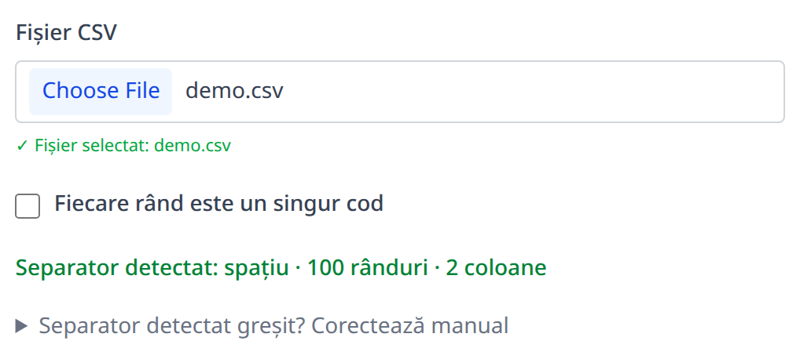

- **CSV file** — upload the file. The **separator** (comma, semicolon, tab,
  space, etc.) is **detected automatically** — you don't need to know anything
  about the CSV format.
- **Summary** (green text) — confirms what the application detected (e.g.
  *"Detected separator: space · 100 rows · 2 columns"*).
- **Warnings** (yellow text) — appear if the file has minor problems (e.g. rows
  with an unequal number of columns, empty rows).
- **Each row is a single code** — checkbox (appears after uploading): joins all
  the fields of a row into a single code. Use it when the whole row is a single
  code, even if it contains the separator.
- **"Separator detected wrongly? Correct it manually"** — collapsible section; if
  the detection got it wrong, enter the correct separator in the **Separator
  between codes on a row** field.

**Fields per row** — while the "single code" checkbox is unticked, the row with
the most fields in the file (the "widest" row) is shown broken into pieces — so
that every possible join point is available — with a button between every two
neighbouring pieces:

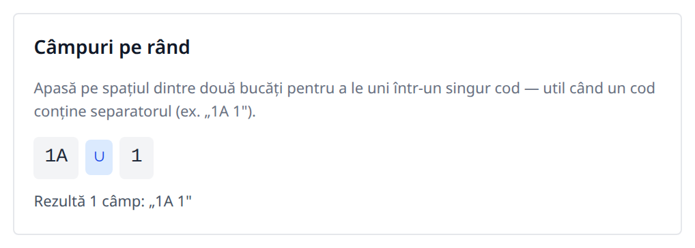

- `|` — the pieces are separate fields (codes); click to **join** them.
- `∪` — the pieces are **joined** into a single field; click to separate them
  again.
- The line underneath shows the outcome: *"Result: N fields: …"*.

This is useful when **a code contains the separator itself**: e.g. the code
"1A 1", with a space separator, got broken into "1A" and "1" — you join the
pieces back into a single field, without re-editing the file.

### 5.3 The data preview

Under both modes, a **preview** of the first rows appears (at most 15; the total
number of rows is shown in the header). It reflects your settings in real time.

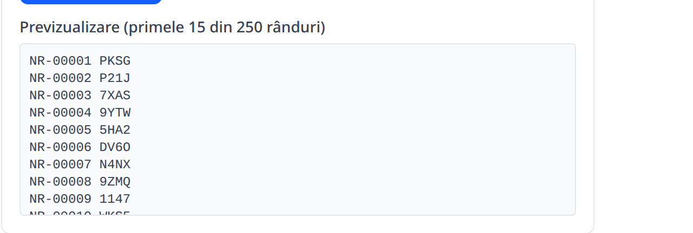

### 5.4 Unlocking the next steps

The **Codes** and **PDF** steps only unlock once the data is ready:

- in **Generate codes** mode — after you press **"Generate CSV"** (and if you
  change the settings, you must regenerate);
- in **Upload CSV** mode — immediately after a successful upload.

Until then, a yellow message appropriate to the current mode appears under the
step: in **Generate codes** — *"Press “Generate CSV” in the “Data” step to
continue."*, and in **Upload CSV** — *"Upload a CSV file in the “Data” step to
continue."*.

---

## 6. Step 4 — Codes

Here you visually arrange the codes on the card. The changes are immediately
visible in the **Preview** (the right column).

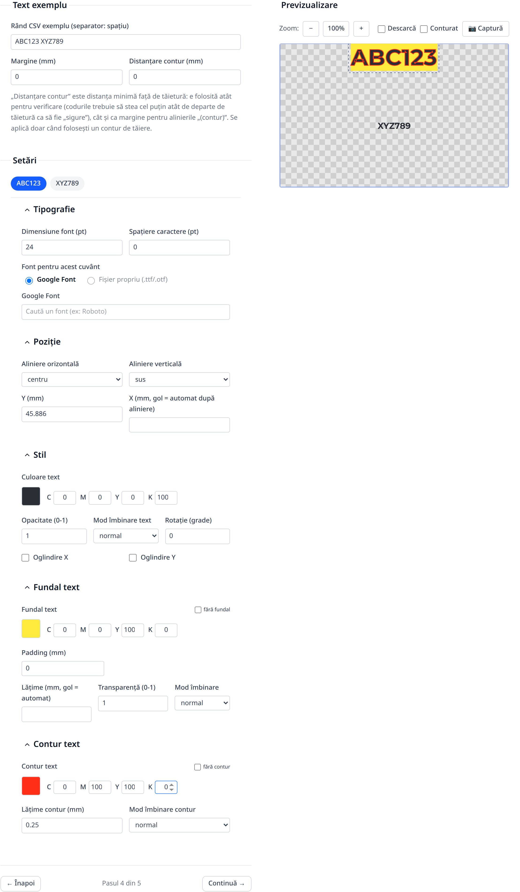

*Select a word in the "Settings" section to adjust its font, alignment, color,
etc. In the preview, the selected code is shown with a dotted frame ("marching
ants") and can be dragged with the mouse.*

### 6.1 Sample text

Here you control the sample row used in the preview and two global margins.

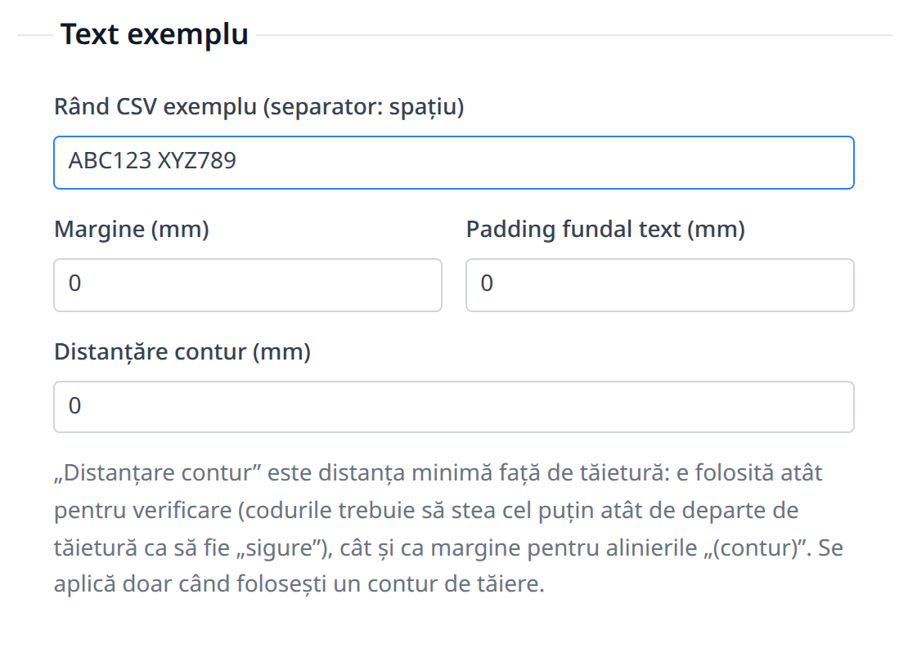

- **Sample CSV row** — a sample row, used **only for the preview** (it does not
  change the real data). The label shows you which **separator** applies, and the
  resulting words appear as buttons in the "Settings" section (see 6.2).
- **Margin (mm)** — the safety zone at the card's edge where **no** text is
  placed; it is also the reference for the top/bottom/left/right alignments.
- **Contour inset (mm)** — the minimum distance from the cut: it is used both for
  checking (codes must stay at least this far from the cut to be "safe") and as
  the margin for the **"(contour)"** alignments. It only applies when a cutting
  contour is used.

### 6.2 Words

The sample row is split into **words** (by the separator). Each word appears as a
button in the "Settings" section; click one to **select** it (it turns blue) and
edit its properties. The selected word is also the one highlighted in the
preview.

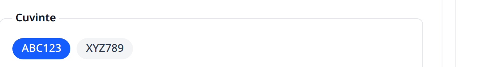

For the selected word, the properties panel appears, split into collapsible
groups: **Typography** and **Position** (open), **Style**, **Text background**
and **Text outline** (collapsed by default — click the title to open them). All
the fields apply **only to the selected word**.

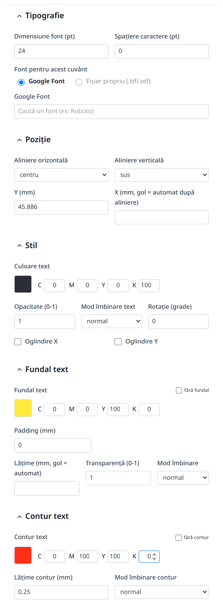

**Typography:**

- **Font size (pt)** — the size of the text.
- **Character spacing (pt)** — the extra space between letters (tracking).
- **Font for this word** — each word can have its own font:
  - **Google Font** — you search by name and choose from the Google Fonts list;
    the suggestions are rendered in the respective font. After choosing, a sample
    text in the chosen font appears, along with the **Style** field (only the
    styles available for that font — regular, bold, italic, etc.) and the
    **Clear** button, which drops the font. If the font does not cover Romanian
    diacritics, the warning *"⚠ This font does not cover Romanian diacritics
    (ș, ț, ă, â, î)."* appears.
  - **Own file (.ttf/.otf)** — you upload your own font file.

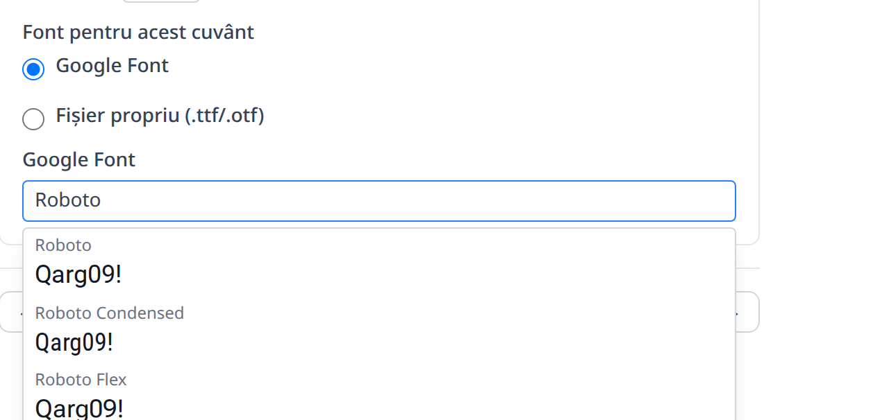

**Position:**

- **Horizontal alignment** — `left` / `center` / `right`. When a cutting contour
  exists, the **`left (contour)` / `center (contour)` / `right (contour)`**
  variants also appear, which align to the contour's box (with the "Contour
  inset" from 6.1 as the margin). The last option, **`at a fixed point`**,
  freezes the current position into the X field.
- **Vertical alignment** — `top` / `middle` / `bottom`, plus the `(contour)`
  variants and `at a fixed point`, with the same meaning.
- **Y (mm)** — the vertical position (measured from the card's bottom). If you
  change it manually, the vertical alignment automatically switches to **"at a
  fixed point"**.
- **X (mm, empty = automatic by alignment)** — the horizontal position. Leave the
  field **empty** so it follows the chosen horizontal alignment; fill it in for a
  fixed position.

> For fixed positions (X filled in, or `at a fixed point`) without contour
> alignment, the warning *"Long codes can extend beyond the background."*
> appears — the position no longer adapts to the code's length.

**Style** (collapsed by default):

- **Text color** — the color of the letters, in CMYK (see **6.4**). Black by
  default (K 100).
- **Opacity (0-1)** — `0` invisible … `1` opaque.
- **Text blend mode** — the text's blend mode over the background (`normal`,
  `multiply`, `screen`, etc.).
- **Rotation (degrees)** — rotates the word.
- **Mirror X** / **Mirror Y** — flips the text horizontally / vertically.

**Text background** (collapsed by default — a colored box behind the text):

- Tick **"no background"** for none. Unticking it reveals:
  - **Padding (mm)** — the space left around the text, inside the box.
  - **Width (mm, empty = automatic)** — the box's width; empty = it fits the
    text automatically (plus the padding above).
  - **Opacity (0-1)** — `0` invisible … `1` opaque.
  - **Blend mode** — the box's blend over the card.

**Text outline** (collapsed by default — a line along the letters' contour):

- Tick **"no outline"** for none. Unticking it reveals:
  - **Outline width (mm)** — the line's thickness.
  - **Outline blend mode** — the outline's blend.

### 6.3 Moving codes directly in the preview

Besides the fields above, you can handle the codes directly in the preview on the
right, with the mouse and keyboard:

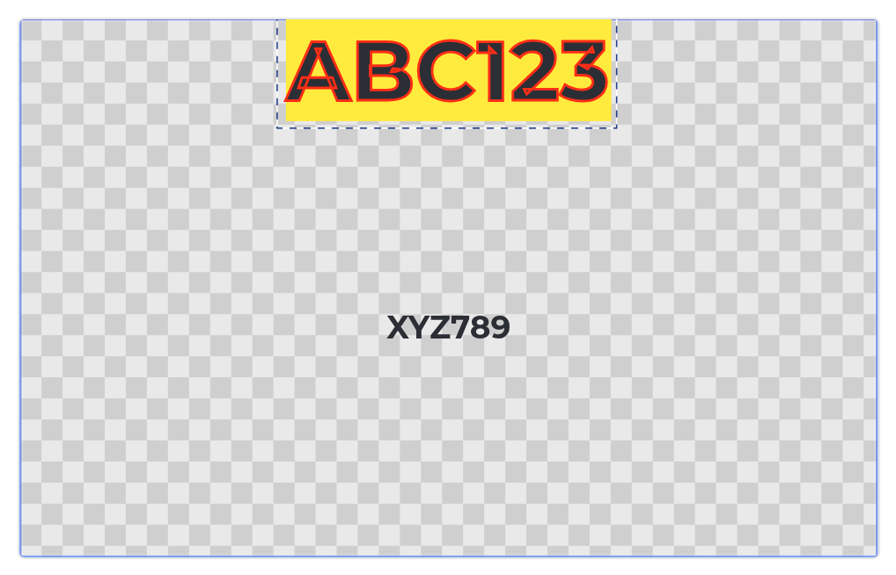

- **Clicking** a code **selects** it — an animated "marching ants" frame appears
  (visible around "ABC123" in the picture).
- **Dragging** **moves** it on the card.
- **Shift + drag** locks the movement to a **single axis** (only horizontal or
  only vertical).
- The **arrow keys** (← ↑ → ↓) nudge the selected code finely, with a small step
  proportional to the card's size (they work while the preview has focus — the
  selecting click gives it focus automatically).

> The picture also shows the effect of the settings from 6.2: "ABC123" has an
> enlarged font, a yellow background and a red outline, while "XYZ789" stays in
> the default style.

### 6.4 The color picker (CMYK)

Every color field ("Text color", "Text background", "Text outline", "Color
(optional)") works the same way:

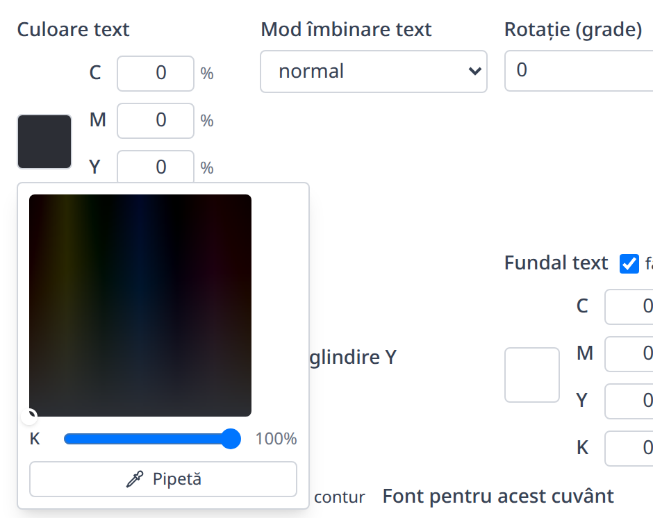

*The color picker: click the colored box to open it. The square picks the
hue/saturation, the **K** slider adjusts the black, the **C M Y K** fields in the
row accept exact values, and the **Eyedropper** picks the color from the
preview.*

- **The colored box** — click it to open the picker.
- **The color square** — you pick the hue and saturation by clicking or dragging.
- **K (slider)** — adjusts the black level.
- **The C, M, Y, K fields** — you enter exact values in percent.
- **Eyedropper** — press it, then **click the preview** to pick the background's
  color exactly under the cursor (press **Esc** or click outside the preview to
  cancel). It works in every browser.
- For the fields with a **"no …"** option, a checkbox sets the color to "none".
  For the other fields, the absence of a color means **white**, and the picker
  stays visible with the values set to white.

---

## 7. Step 5 — PDF

Here you produce the final PDFs.

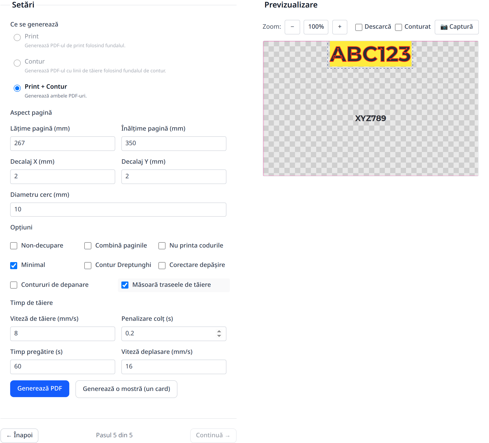

*The "PDF" screen: you choose what to generate (Print / Contour / both), adjust
the page layout and the options. When you tick "Measure the cutting paths", the
"Cutting time" parameters appear.*

The data is no longer chosen here: the CSV prepared at **Step 3 — Data** is used.

### 7.1 Request a quote (only if generation is protected)

Some instances lock generation behind a **password**. Only in that case do the
**"Request a quote"** section and the unlock below appear. If no password is
configured, skip straight to 7.3.

"Request a quote" lets you send your configuration without generating the PDF
yourself:

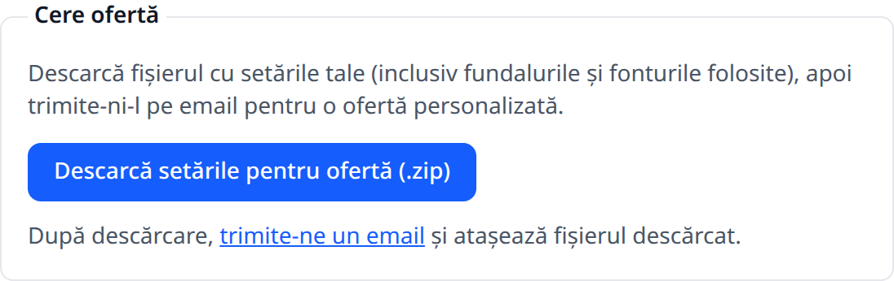

- **Download the settings for a quote (.zip)** — downloads a file with **all**
  your configuration (including the backgrounds and fonts used).
- **send us an email** — a prepared link (opens your email client with the
  subject and message filled in); attach the downloaded `.zip` file.

### 7.2 Unlocking (if applicable)

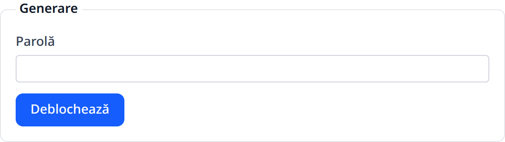

- **Password** — enter the password you received.
- **Unlock** — confirms. If the password is wrong, a red message appears; if it
  is correct, the generation options appear (7.3). The unlock lasts for the
  session.

### 7.3 Generation options

#### 7.3.1 What to generate

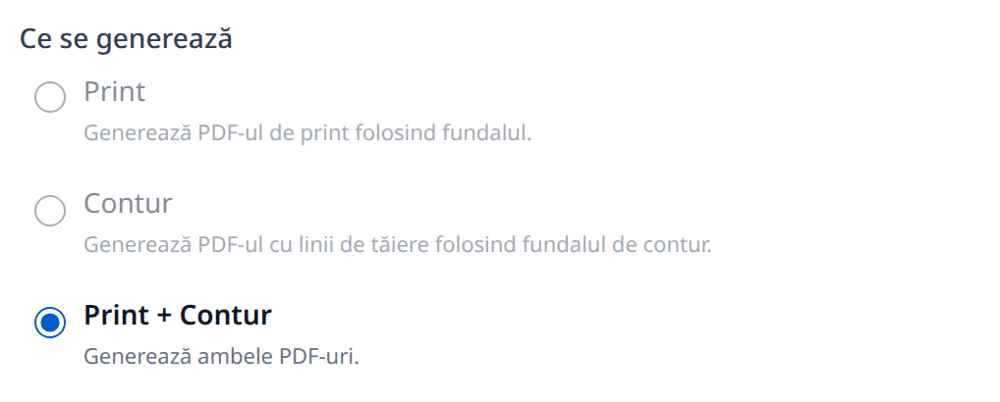

- **Print** — only the print PDF (the cards on the background).
- **Contour** — only the PDF with the cutting lines (on the contour background).
- **Print + Contour** — both files.

#### 7.3.2 Page layout

Defines the sheet on which the cards are laid out ("imposed"). The section
disappears when you tick **"No cutting"** (see 7.3.3) — there is no imposition
then.

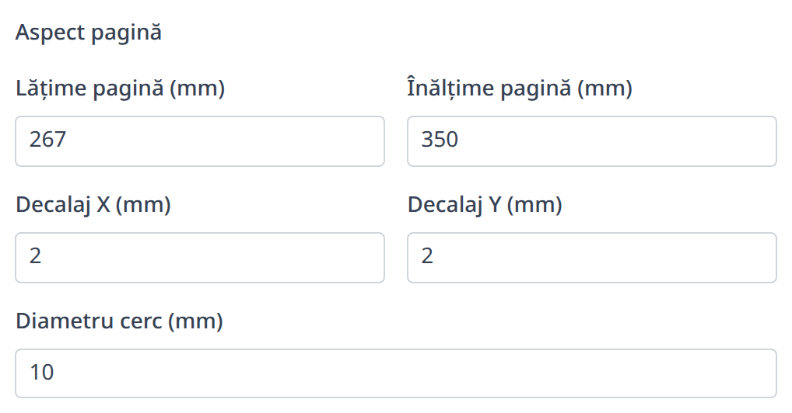

- **Page width (mm)** / **Page height (mm)** — the sheet's size.
- **Offset X (mm)** / **Offset Y (mm)** — the space between the cuts of two
  neighbouring cards, horizontally / vertically. Only a plain rectangular contour
  can have offset `0` (the cards share the same cutting line); for the other
  shapes use at least **1.0 mm**, otherwise neighbouring cuts overlap and the
  material can be damaged (a yellow warning appears).
- **Circle diameter (mm)** — the diameter of the **registration circles** the
  cutter uses for alignment. They reserve a band along the sheet's edges: the
  area that can be cut is the page **minus** one diameter on each edge.

#### 7.3.3 Options

Some checkboxes only appear in certain modes — e.g. the print-related ones only
for "Print" / "Print + Contour", and the cutting ones only for "Contour" /
"Print + Contour".

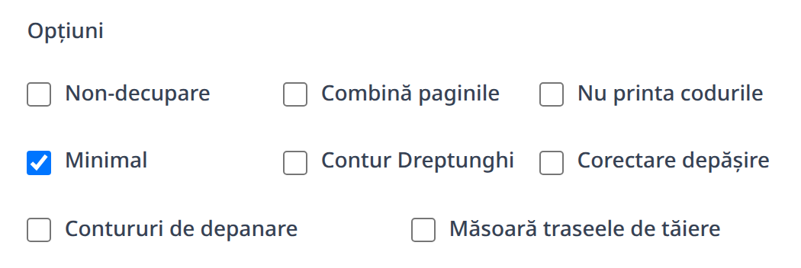

- **No cutting** — one card per page, without imposition and without registration
  circles; hides "Page layout".
- **Combine the pages** — overlays the cutting lines onto the print pages, in a
  single file (only with print, without "No cutting").
- **Don't print the codes** — generates the print PDF without texts (the same
  layout, backgrounds only).
- **Minimal** — crops the generated page to the contour's box.
- **Rectangle contour** — only for the preset **rectangle** shape: emits plain
  rectangles instead of the optimized cutting lines (grid).
- **Overflow correction** — automatically shrinks the codes that overflow the
  contour (or the card) until they fit, but not below **Minimum font (pt)**;
  those that still don't fit remain flagged. **Apply the shrinking** chooses
  whether the shrinking is **Per code** (only the overflowing code) or **Per
  column** (the whole column gets the same size).
- **Debug outlines** — adds helper lines for checking.
- **Measure the cutting paths** — computes the cutting metrics (see §9) and opens
  the "Cutting time" settings (7.3.5).

#### 7.3.4 Warnings

Below the options, yellow messages may appear flagging size mismatches:

- **The background does not fit in the page** — enlarge the page or shrink the
  card.
- **The contour does not fit in the cutting area** (the page minus the
  registration circles) — enlarge the page, reduce the circle diameter or the
  contour.
- **The contour was reduced to fit inside the background** — the requested size
  or rotation was limited automatically; reduce the contour or the rotation to
  use the desired value.
- **Offset X/Y too small** for the chosen contour shape (see 7.3.2).

#### 7.3.5 Cutting time

Only appears when **"Measure the cutting paths"** is ticked. These are the
parameters used to estimate the cutting duration (see the metrics in §9).

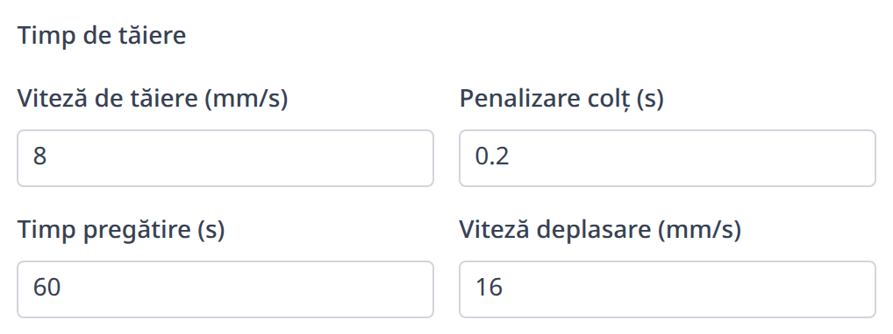

- **Cutting speed (mm/s)** — the blade's speed while cutting.
- **Corner penalty (s)** — the time added at every sharp corner.
- **Preparation time (s)** — fixed preparation time per job.
- **Travel speed (mm/s)** — the speed of the non-cutting moves (between
  contours).

### 7.4 Starting the generation

- **Generate PDF** — starts the actual generation. While it works, the button is
  replaced by a **progress indicator** (the Print/Contour phase, rows processed,
  batches, memory used) and the **Cancel** button.
- **Generate a sample (one card)** — a quick proof: a single card, with the
  contour overlaid on top, without the whole batch. Ideal for checking the layout
  before a big run.
- Errors (e.g. a missing contour background when generating the contour) appear
  in **red** under the buttons.

---

## 8. The preview (right column)

The **"Preview"** section always shows the current card, updated in real time as
you change the settings. If you don't have a background yet, a message asks you
to configure it at Step 1.

Above the card there is a toolbar:

- **Zoom** — the **− / +** buttons zoom the preview out or in; the percentage
  button (e.g. `100%`) brings it back to the normal size. When zoomed in, you can
  **pan it by dragging**.
- **📷 Capture** — copies an image of the preview to the clipboard. With the
  **"Download"** checkbox, the image is downloaded as a file instead of being
  copied. With the **"Contoured"** checkbox (active only when a contour exists),
  the capture crops only the inside of the contour, as a transparent PNG.

---

## 9. Result

After generating, the **"Result"** section appears in the right column:

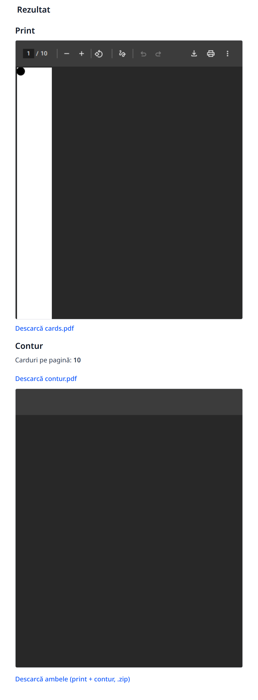

*For each PDF there is a download link and a preview. For "Contour", if you
enabled measuring, the cutting metrics are shown (cards per page, path length,
nodes, sharp corners, cutting time).*

- For each generated PDF: a **download link** and an embedded **preview**.
- A generated **sample** (7.4) appears here too, as **"Sample (one card)"**, with
  its own download link and its own preview.
- If the print job is split into batches, a **ZIP archive** is downloaded (with a
  preview of the first PDF).
- For **Print**, if some codes fall outside the cutting area or off the card, a
  yellow warning appears: *"⚠ N rows contain codes that overflow the cutting
  area or the card's space (e.g. …)"*, together with the **"Download the
  overflows (N, .csv)"** link — it downloads the affected rows as
  `depasiri.csv`, so you can find them in the source data.
- When you generated both files ("Print + Contour"), the **"Download both (print
  + contour, .zip)"** button also appears — a single archive with everything.
- For **Contour**, if you enabled measuring, metrics are shown:
  - **Cards per page**.
  - **Path length / card** and **total**.
  - **Nodes / card** and **total**.
  - **Sharp corners / card** and **total**.
  - **Cutting time / card** and **total**.

---

## 10. Recommended workflow

1. **Background** — choose or upload the print background (PDF, plain color or
   image) and position it.
2. **Contour** — set the cutting shape (PDF/SVG file or preset shape) and adjust
   its size and position.
3. **Data** — generate or upload the CSV with codes; press **"Generate CSV"**
   (when generating) to unlock the next steps.
4. **Codes** — place and style the codes; check in the preview (drag the codes,
   use the eyedropper for colors) and make a **sample** if needed.
5. **PDF** — choose Print / Contour / both, press **"Generate PDF"** and download
   the results.

> Tip: save your configuration with **"Save settings (.zip)"** so you can resume
> your work at any time exactly where you left off.
