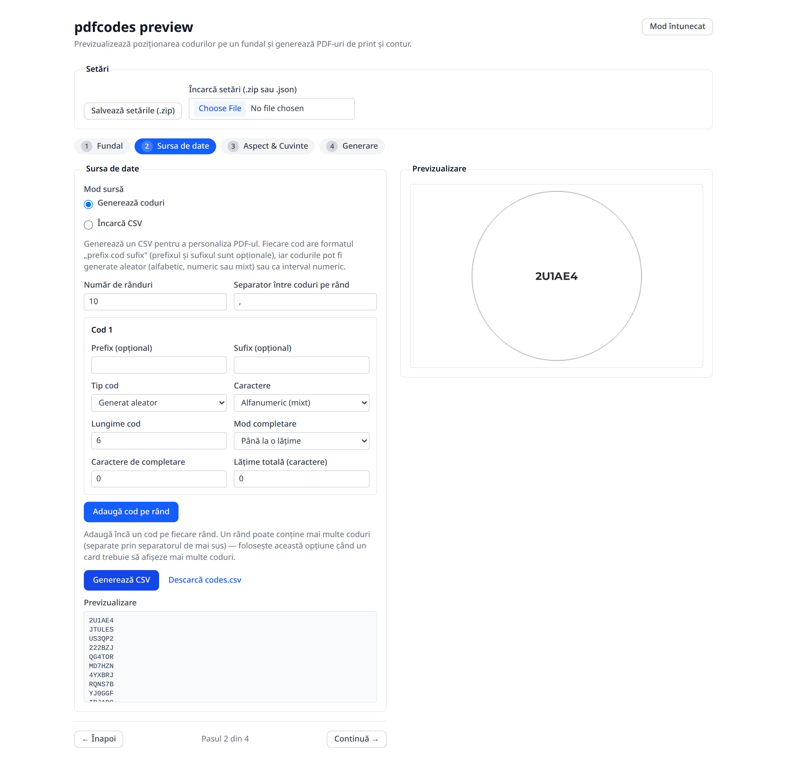
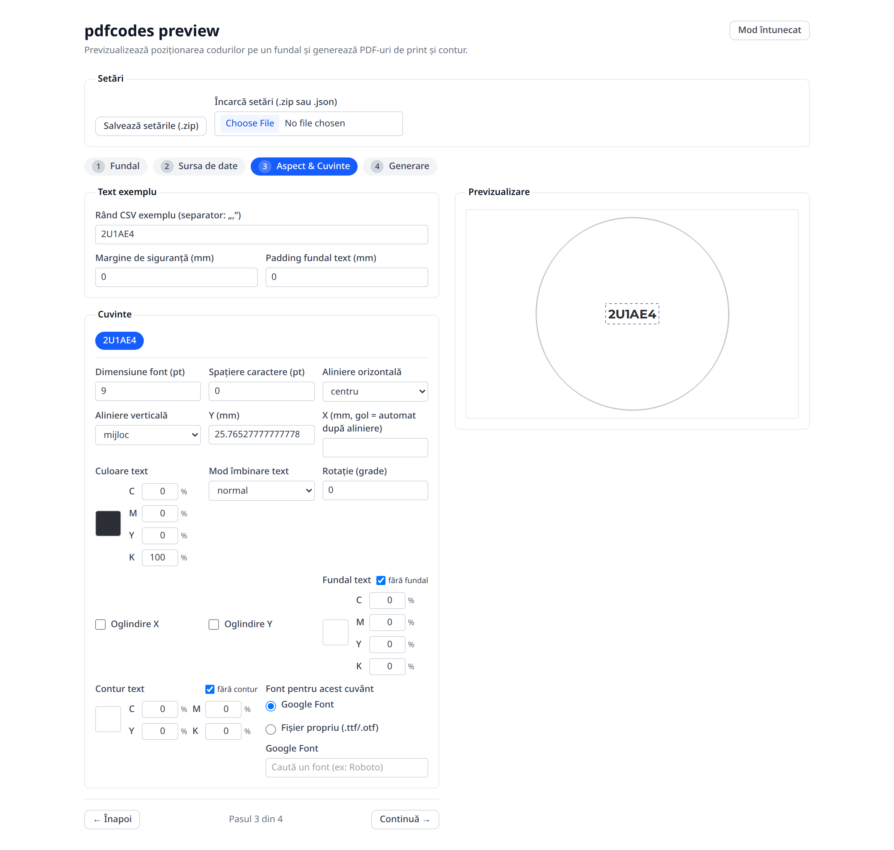
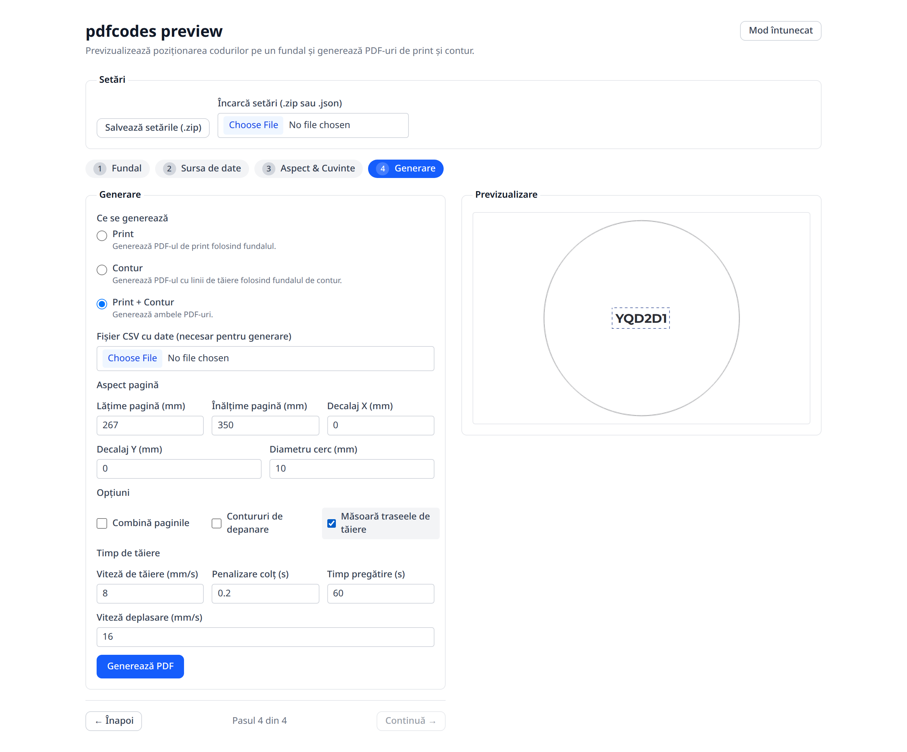
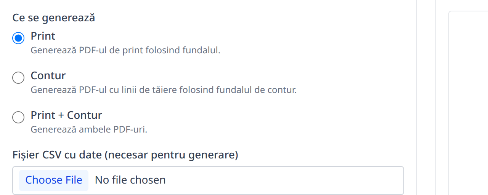

# Manual de utilizare — pdfcodes preview

Acest manual explică, pas cu pas, cum se folosește aplicația pentru a aranja
coduri (text) pe un fundal și a genera PDF-uri pregătite pentru **print** și
pentru **tăiere pe contur**.

---

## 1. Ce face aplicația

- Așezi unul sau mai multe **coduri** (text) peste un **fundal** (un card).
- Tai cardul pe un **contur** — o formă dintr-un fișier (**PDF sau SVG**) sau o
  **formă presetată** (cerc, dreptunghi rotunjit etc.).
- Vezi **în timp real** cum vor arăta cardurile, într-o previzualizare.
- Codurile (datele) pot fi **generate automat** sau încărcate dintr-un fișier
  **CSV** propriu.
- Obții la final unul sau două PDF-uri:
  - **Print** — cardurile cu fundal și text, așezate (impuse) pe pagină.
  - **Contur** — liniile de tăiere (pentru plotter/cutter).

Toate culorile sunt în **CMYK** (cum se tipărește), iar previzualizarea pe
ecran este o aproximare RGB a culorii de print.

---

## 2. Interfața generală

Ecranul are două coloane:

- **Stânga** — panoul de configurare (se schimbă în funcție de pasul curent).
- **Dreapta** — **Previzualizarea** cardului și, după generare, **Rezultatul**.

Sus, în antet, găsești:

- Titlul aplicației.
- **Salvează setările (.zip)** — descarcă toate alegerile tale (vezi 2.2).
- Butoanele **↶ / ↷** — **Anulează / Refă** (echivalent Ctrl+Z / Ctrl+Shift+Z).
- Butonul **„Mod luminos” / „Mod întunecat”** — comută tema vizuală.

### 2.1 Pașii (asistentul / wizard)

Sub secțiunea „Presetări” există o bară cu **5 pași**, care trebuie parcurși în ordine:

1. **Fundal** — fundalul cardului (PDF, culoare simplă sau imagine generată).
2. **Contur** — forma de tăiere (fișier PDF/SVG sau formă presetată).
3. **Date** — sursa codurilor (generate automat sau dintr-un CSV).
4. **Coduri** — aspectul și poziționarea textului pe card.
5. **PDF** — generarea PDF-urilor de print și de contur.

Pașii se **deblochează pe rând**:

- **Fundal** este mereu disponibil.
- **Contur** se deblochează după ce ai configurat fundalul.
- **Date** se deblochează după fundal **și** contur.
- **Coduri** și **PDF** se deblochează după ce ai pregătit și datele.

Dacă un pas este blocat, apare un mesaj care îți spune ce mai ai de făcut.
Jos găsești butoanele de navigare **Înapoi / Continuă** și indicatorul „Pasul X din 5”.

### 2.2 Presetări (salvare și încărcare)

- **Salvează setările (.zip)** — buton în **antet** (sus), lângă butoanele de
  anulare/refacere. Descarcă un fișier `.zip` cu **toate** alegerile tale, inclusiv
  fundalul, conturul și fonturile folosite, plus o miniatură `thumbnail.png` a
  previzualizării (când există). Util pentru a relua munca mai târziu sau pe alt
  calculator.
- Secțiunea **„Presetări”** (pliabilă, sus) — **Încarcă setări (.zip sau .json)**
  reîncarcă o configurație salvată anterior.

---

## 3. Pasul 1 — Fundal

Aici stabilești **fundalul cardului** — imaginea (sau culoarea) pe care se
tipărește și peste care vei așeza codurile. Pasul e complet când există un
fundal valid; **forma de tăiere se stabilește separat, în Pasul 2 — Contur.**

*Ecranul „Fundal”: stânga — configurarea fundalului; dreapta — previzualizarea
cardului. Sus se văd antetul, bara cu cei 5 pași și secțiunea „Presetări”.*

Primul comutator, **Sursă**, alege de unde vine cardul. Sunt trei variante —
**Încarcă PDF**, **Simplu** și **Imagine** — iar sub el apar câmpuri diferite în
funcție de alegere.

### 3.1 Încarcă PDF

Folosești un PDF gata făcut care conține **un singur card** (nu o coală
întreagă).

- **PDF (un card)** — butonul **„Choose File”** deschide selectorul de fișiere.
  Dacă PDF-ul are mai multe pagini, alături (pe același rând) apare câmpul
  **Pagina (1–N)** pentru a alege pagina folosită.
- **Dimensiuni detectate** — banda albastră afișată imediat ce PDF-ul e citit.
  Arată dimensiunea reală a paginii în **mm** (și, în paranteză, în **puncte
  tipografice — pt**). Este informativă, nu o poți edita.
- **Lățime țintă (mm)** / **Înălțime țintă (mm)** — opțional. Pre-completate cu
  dimensiunea detectată; le poți modifica pentru a **redimensiona** cardul.
  Butonul **lacăt** păstrează proporția, iar butonul cu **săgeți** schimbă între
  ele lățimea și înălțimea (portret ⇄ peisaj). Codurile deja așezate își păstrează
  poziția **relativă**, deci nu trebuie rearanjate.
- **↻ Rotește 90°** — rotește fundalul cu 90° (indicatorul **„Rotație: …°”** arată
  unghiul curent).
- **Oglindire X** / **Oglindire Y** — răstoarnă fundalul pe orizontală / verticală.

### 3.2 Simplu

Generezi cardul direct în aplicație, fără un PDF — util pentru un simplu
dreptunghi colorat sau transparent.

- **Lățime (mm)** / **Înălțime (mm)** — dimensiunile cardului generat (cu lacătul
  de proporție alături).
- **Culoare (opțional)** — culoarea de umplere, în **CMYK** (vezi secțiunea **6.4**
  pentru cum se folosește selectorul).
  - Bifează **„fără culoare”** (colțul din dreapta-sus) pentru un card **fără
    umplere** — transparent. Când e bifată, câmpurile CMYK dispar.

### 3.3 Imagine

Construiești fundalul dintr-o **imagine** (PNG, JPEG sau SVG), care este întinsă
peste card la dimensiunile țintă.

- **Sursă imagine** — de unde iei imaginea:
  - **Fișier local** — câmpul **Imagine (PNG, JPEG sau SVG)** deschide selectorul
    de fișiere.
  - **URL** — lipești o adresă și apeși **„Încarcă”**.
  - **Clipboard** — apeși **„📋 Lipește imaginea”**, `Ctrl+V` sau tragi o imagine
    în zona punctată.
- La un **SVG cu text** apare un avertisment: convertește textul în contururi
  (outline) înainte de încărcare.
- După încărcare apar **Lățime țintă (mm)** / **Înălțime țintă (mm)** (cu lacăt și
  schimbare), **↻ Rotește 90°** și **Oglindire X/Y**, la fel ca la PDF. Dacă
  imaginea are zone transparente, apare și **Culoare zone transparente** (alege o
  culoare de umplere sau „carouri” pentru a păstra transparența).

### 3.4 Poziționare (comun tuturor surselor)

Odată ce există un fundal, jos apare blocul **Poziționare**, care influențează
**doar fundalul** (nu forma de tăiere):

- **Mută fundalul** — activează tragerea fundalului direct în previzualizare.
- **Decalaj X (mm)** / **Decalaj Y (mm)** — deplasează fundalul în cadrul cardului.
- **Rotație (grade)** — rotește fin fundalul (orice unghi, nu doar 90°).
- **Culoare zone libere** — culoarea cu care se umplu zonele rămase libere după
  deplasare/rotire; **„transparent”** le lasă goale.

> Conturul (forma de tăiere) nu se mai configurează aici, ci în **Pasul 2 —
> Contur** (secțiunea următoare, în curs de actualizare).

---

## 4. Pasul 2 — Contur

Aici stabilești **conturul** — linia după care se taie cardul (pentru
plotter/cutter). Pasul e complet când există un contur valid. Conturul poate veni
dintr-un **fișier** propriu sau dintr-o **formă presetată**.

*Ecranul „Contur”: forma de tăiere (aici un cerc) apare peste card în
previzualizare; „Întunecă exteriorul conturului” estompează zona care se aruncă.*

Primul comutator, **Sursă**, alege între **Încarcă PDF/SVG** și **Formă presetată**.

### 4.1 Încarcă PDF/SVG

Folosești propria linie de tăiere dintr-un fișier **PDF** sau **SVG**.

- **Sursă fișier** — de unde iei fișierul:
  - **Fișier local** — câmpul **PDF sau SVG (opțional)** deschide selectorul de
    fișiere. Dacă PDF-ul are mai multe pagini, alături (pe același rând) apare
    **Pagina (1–N)**.
  - **URL** — lipești o adresă și apeși **„Încarcă”**.
  - **Clipboard** — apeși **„📋 Lipește fișierul”**, `Ctrl+V` sau tragi un fișier
    PDF/SVG (ori cod SVG) în zona punctată.
- La un **SVG cu text** apare un avertisment: convertește textul în contururi
  (outline) înainte de încărcare.
- **Dimensiunea conturului (nu a paginii)** — bifează pentru ca dimensiunea să fie
  cea a desenului, ignorând marginile goale ale paginii. Aliniază cu grijă
  decuparea la print (apare un avertisment cât timp e activă).

### 4.2 Formă presetată

Aplicația desenează singură conturul, pe baza dimensiunilor cardului.

- **Formă** — lista de forme: **Cerc**, **Elipsă**, **Dreptunghi**, **Dreptunghi cu
  colțuri rotunjite**, **Dreptunghi cu colțuri teșite**, **Inimă** și **Poligon**.
  În funcție de formă apar câmpuri suplimentare:
  - **Dreptunghi cu colțuri rotunjite** — **Raza colțurilor (mm)** și **Orientare**
    (**În afară** = colțuri rotunjite normale / **În interior** = colțuri „scobite”).
  - **Dreptunghi cu colțuri teșite** — **Teșire colțuri (mm)** (colțul tăiat drept).
  - **Poligon** — **Număr laturi** și opțiunea **Stea (vârfuri spre interior)**.
- Forma presetată are nevoie de un fundal cu dimensiuni cunoscute; altfel apare
  mesajul *„Încarcă întâi PDF-ul de fundal pentru a genera forma.”*

### 4.3 Reglaje contur (comune ambelor surse)

Odată ce conturul există, apar reglaje care se aplică atât fișierului încărcat, cât
și formei presetate:

- **Dimensiune** — dimensiunea curentă a conturului (informativ, în mm).
- **Lățime țintă (mm)** / **Înălțime țintă (mm)** — redimensionează conturul (cu
  **lacăt** de proporție și buton de **schimbare** lățime ⇄ înălțime). Cercul rămâne
  1:1.
- **↻ Rotește 90°** (cu indicatorul **„Rotație: …°”**) — rotește conturul cu 90°.
- **Rotație (grade)** — rotire fină, la orice unghi.
- **Redesenează (decalaj mm, + în afară / − în interior)** — decalează **întreaga
  linie de tăiere** (die-line) cu aceeași distanță: pozitiv o mărește (bleed),
  negativ o micșorează (margine de siguranță). `0` = neschimbat.
- **Decalaj X / Decalaj Y (mm)** — poziționează conturul în cadrul cardului, cu
  butoanele **Centrează: ↔ Orizontal / ↕ Vertical**. Apar doar când conturul e mai
  mic decât fundalul; altfel un mesaj anunță că „conturul ocupă tot fundalul”.
- **Transparență (0–1)** și **Mod combinare** — cât de vizibil e conturul peste
  fundal în previzualizare și modul de îmbinare (`normal`, `multiply`, `screen`,
  `overlay` etc.). Afectează **doar previzualizarea**.
- **Întunecă exteriorul conturului (doar previzualizare)** — estompează zona din
  afara tăieturii, ca să vezi ce păstrează conturul. Nu schimbă fișierul de tăiere.

---

## 5. Pasul 3 — Sursa de date

Aici stabilești **codurile** care vor apărea pe carduri. **Fiecare rând = un card.**

*Modul „Generează coduri”: setezi numărul de rânduri și formatul codului, apeși
„Generează CSV”, apoi vezi o previzualizare a primelor rânduri (și poți descărca
`codes.csv`).*

Primul comutator, **Mod sursă**, alege de unde vin codurile: le **generează**
aplicația sau le **încarci** dintr-un fișier CSV propriu.

### 5.1 Generează coduri

Aplicația creează automat fișierul CSV după regulile pe care le definești aici.

#### 5.1.1 Setări generale

- **Număr de rânduri** — câte carduri se generează (un rând = un card).
- **Separator între coduri pe rând** — caracterul care desparte mai multe coduri de
  pe **același** rând. Contează doar dacă un card afișează mai multe coduri (vezi
  5.1.4). Implicit este virgula `,`; poți pune un spațiu, `;`, `|` etc.

#### 5.1.2 Blocul „Cod” — structura unui cod

Fiecare cod se construiește după tiparul **prefix + cod + sufix**. Câmpurile sunt:

- **Prefix (opțional)** / **Sufix (opțional)** — text fix adăugat **înainte** /
  **după** cod, lipit direct (fără spațiu — dacă vrei un spațiu, include-l tu în
  prefix/sufix).
- **Tip cod** — alege cum se produce partea variabilă a codului:
  - **Generat aleator** — afișează **Caractere** (set de simboluri: `Numeric`,
    `Alfabetic` sau `Alfanumeric (mixt)`) și **Lungime cod** (câte caractere are).
  - **Interval numeric** — afișează **Start interval** și **Pas**: codurile sunt
    numere consecutive (ex. start `1`, pas `1` → 1, 2, 3 …; pas `10` → 1000, 1010 …).

#### 5.1.3 Completarea (padding)

Padding-ul aliniază codurile la o lungime fixă (util ca toate să arate la fel, ex.
`00001`, `00002`).

- **Mod completare**:
  - **Până la o lățime** — completează codul cu **Caractere de completare** până la
    **Lățime totală (caractere)**. Ex.: cod `7` + caracter `0` + lățime `5` → `00007`.
  - **Text fix adăugat** — adaugă pur și simplu caracterele de completare în față,
    fără o lățime-țintă.
- **Caractere de completare** — caracterul folosit la completare (de obicei `0`).
- **Lățime totală (caractere)** — apare doar la „Până la o lățime”.

> Notă: dacă lățimea totală este **mai mică sau egală** cu lungimea codului,
> completarea nu are efect și apare un avertisment galben:

#### 5.1.4 Mai multe coduri pe rând

Butonul **„Adaugă cod pe rând”** adaugă încă un bloc „Cod”, deci **fiecare card va
afișa mai multe coduri**, despărțite de separatorul din 5.1.1. Fiecare bloc în plus
are un buton **„Elimină”**.

#### 5.1.5 Generarea

- **Generează CSV** — produce datele. La loturi mari, butonul arată progresul
  (`Se generează… 1.234 / 250`).
- **Descarcă codes.csv** — apare lângă buton după generare; descarcă fișierul.

> Important: dacă schimbi rândurile, codurile sau separatorul **după** generare,
> apare *„Setările s-au modificat. Regenerați CSV-ul…”* — apasă din nou
> **„Generează CSV”** ca să poți continua la pașii următori.

### 5.2 Încarcă CSV

Folosești un fișier CSV gata făcut. Fiecare rând devine un card.

- **Fișier CSV** — butonul **„Choose File”** încarcă fișierul. **Separatorul**
  (virgulă, punct și virgulă, tab, spațiu etc.) este **detectat automat**.
- **Rezumat** (text verde) — confirmă ce a detectat aplicația: separatorul,
  numărul de rânduri și de coloane (ex. *„Separator detectat: spațiu · 100 rânduri ·
  2 coloane”*).
- **Avertismente** (text galben) — apar dacă fișierul are probleme minore (ex.
  rânduri cu număr inegal de coloane, rânduri goale).
- **„Separator detectat greșit? Corectează manual”** — secțiune pliabilă; dacă
  detecția a greșit, o deschizi și introduci manual separatorul corect în câmpul
  **Separator între coduri pe rând**.

### 5.3 Previzualizarea datelor

Sub ambele moduri apare o **previzualizare** a primelor rânduri (maximum 15), cu
numărul total de rânduri afișat în antet. Reflectă în timp real setările tale.

---

## 6. Pasul 4 — Aspect & Cuvinte

Aici aranjezi vizual codurile pe card. Modificările se văd imediat în
**Previzualizare** (coloana dreaptă).

*Selectează un cuvânt din zona „Cuvinte” pentru a-i regla fontul, alinierea,
culoarea etc. În previzualizare, codul selectat apare cu un chenar punctat
(„marching ants”) și poate fi tras cu mouse-ul.*

### 6.1 Text exemplu

Aici controlezi rândul de probă folosit în previzualizare și două margini globale.

- **Rând CSV exemplu** — un rând de probă, folosit **doar pentru previzualizare**
  (nu modifică datele reale). Eticheta îți arată ce **separator** se aplică (în
  imagine: „spațiu”), iar cuvintele rezultate apar ca butoane în „Cuvinte”.
- **Margine de siguranță (mm)** — zona de la marginea cardului în care **nu** se
  așază text; este și referința pentru alinierile sus/jos/stânga/dreapta.
- **Padding fundal text (mm)** — spațiul lăsat în jurul textului atunci când acesta
  are un **fundal propriu** (vezi „Fundal text” mai jos).

### 6.2 Cuvinte

Rândul de probă se împarte în **cuvinte** (după separator). Fiecare cuvânt apare ca
un buton; apasă pe unul ca să-l **selectezi** (devine albastru) și să-i editezi
proprietățile. Cuvântul selectat este și cel evidențiat în previzualizare.

Pentru cuvântul selectat apare panoul de proprietăți de mai jos. Toate câmpurile se
aplică **doar cuvântului selectat** (excepție: fontul — vezi nota de la final).

**Tipografie și poziție:**

- **Dimensiune font (pt)** — mărimea textului.
- **Spațiere caractere (pt)** — spațiul suplimentar dintre litere (tracking).
- **Aliniere orizontală** — `stânga` / `centru` / `dreapta`. Schimbarea ei
  **resetează X la „automat”** (golul din câmpul X).
- **Aliniere verticală** — `sus` / `mijloc` / `jos` / `personalizat`.
- **Y (mm)** — poziția pe verticală (măsurată de la baza cardului). Dacă o
  modifici manual, alinierea verticală trece automat pe **„personalizat”** (vezi
  imaginea: Y = 25 → „personalizat”).
- **X (mm, gol = automat după aliniere)** — poziția pe orizontală. Lasă câmpul
  **gol** ca să urmeze alinierea orizontală aleasă; completează-l pentru o poziție
  fixă.

**Culoare și aspect:**

- **Culoare text** — culoarea literelor, în CMYK (vezi **6.4**). Implicit negru
  (K 100).
- **Mod îmbinare text** — modul de blend al textului peste fundal (`normal`,
  `multiply`, `screen` etc.).
- **Rotație (grade)** — rotește cuvântul.
- **Oglindire X** / **Oglindire Y** — întoarce textul pe orizontală / verticală.

**Fundal text** (o casetă colorată în spatele textului):

- Bifează **„fără fundal”** pentru niciun fundal. Debifând-o, apar:
  - **Lățime fundal (mm, gol = automat)** — lățimea casetei; gol = se potrivește
    automat pe text (plus padding-ul din 6.1).
  - **Transparență fundal (0–1)** — `0` invizibil … `1` opac.
  - **Mod îmbinare fundal** — blend-ul casetei peste card.

**Contur text** (un contur pe conturul literelor):

- Bifează **„fără contur”** pentru niciunul. Debifând-o, apar:
  - **Lățime contur (mm)** — grosimea liniei.
  - **Mod îmbinare contur** — blend-ul conturului.

**Font pentru acest cuvânt:**

- **Google Font** — cauți după nume și alegi din lista Google Fonts; sugestiile
  sunt afișate chiar cu fontul respectiv.
- **Fișier propriu (.ttf/.otf)** — încarci propriul tău fișier de font.
- Notă: dacă un singur cuvânt are font setat, acel font se aplică **tuturor**
  cuvintelor.

### 6.3 Mutarea codurilor direct în previzualizare

Pe lângă câmpurile de mai sus, poți manevra codurile direct în previzualizarea din
dreapta, cu mouse-ul și tastatura:

- **Clic** pe un cod îl **selectează** — apare un chenar animat „marching ants”
  (vizibil în jurul lui „ABC123” în imagine).
- **Tragere (drag)** îl **mută** pe card.
- **Shift + tragere** blochează mișcarea pe **o singură axă** (doar orizontal sau
  doar vertical).
- **Săgețile** (← ↑ → ↓) deplasează fin codul selectat, cu pas mic proporțional cu
  dimensiunea cardului.

> Imaginea arată și efectul setărilor din 6.2: „ABC123” are font mărit, fundal
> galben și contur roșu, în timp ce „XYZ789” rămâne în stilul implicit.

### 6.4 Selectorul de culoare (CMYK)

Orice câmp de culoare („Culoare text”, „Fundal text”, „Contur text”, „Culoare
fundal”) funcționează la fel:

*Selectorul de culoare: apasă pe caseta colorată pentru a-l deschide. Pătratul
alege nuanța/saturația, cursorul **K** reglează negrul, câmpurile **C M Y K** din
rând acceptă valori exacte, iar **Pipeta** preia culoarea din previzualizare.*

- **Caseta colorată** — apasă pe ea pentru a deschide selectorul.
- **Pătratul de culoare** — alegi nuanța și saturația cu clic sau prin tragere.
- **K (cursor)** — reglează nivelul de negru.
- **Câmpurile C, M, Y, K** — introduci valorile exacte în procente.
- **Pipetă** — apasă, apoi **dă clic pe previzualizare** pentru a prelua culoarea
  din fundal exact de sub cursor (apasă **Esc** sau clic în afara previzualizării
  pentru a renunța). Funcționează în orice browser.
- La câmpurile cu opțiunea **„fără …”**, o bifă setează culoarea pe „niciuna”.
  La celelalte câmpuri, lipsa unei culori înseamnă **alb**, iar selectorul rămâne
  vizibil cu valorile pe alb.

---

## 7. Pasul 5 — Generare

Aici produci PDF-urile finale.

*Ecranul „Generare”: alegi ce se generează (Print / Contur / ambele), reglezi
aspectul paginii și opțiunile. Când bifezi „Măsoară traseele de tăiere” apar
parametrii pentru „Timp de tăiere”.*

### 7.1 Cere ofertă (doar dacă generarea e protejată)

Unele instanțe blochează generarea în spatele unei **parole**. Doar în acest caz
apar secțiunile **„Cere ofertă”** și deblocarea de mai jos. Dacă nu e configurată
nicio parolă, treci direct la 7.3.

„Cere ofertă” îți permite să trimiți configurația fără să generezi singur PDF-ul:

- **Descarcă setările pentru ofertă (.zip)** — descarcă un fișier cu **toată**
  configurația ta (inclusiv fundalurile și fonturile folosite).
- **trimite-ne un email** — link pregătit (deschide clientul de email cu subiect și
  mesaj completate); atașează fișierul `.zip` descărcat.

### 7.2 Deblocare (dacă este cazul)

- **Parolă** — introdu parola primită.
- **Deblochează** — confirmă. Dacă parola e greșită, apare un mesaj roșu; dacă e
  corectă, apar opțiunile de generare (7.3). Deblocarea ține cât durează sesiunea.

### 7.3 Opțiuni de generare

#### 7.3.1 Ce se generează și datele

- **Ce se generează**:
  - **Print** — doar PDF-ul de print (cardurile pe fundal).
  - **Contur** — doar PDF-ul cu liniile de tăiere (pe fundalul de contur).
  - **Print + Contur** — ambele fișiere.
- **Fișier CSV cu date (necesar pentru generare)** — fișierul cu coduri folosit la
  generare. Dacă ai generat sau încărcat datele la **Pasul 2**, este deja pregătit
  (chiar dacă aici scrie „No file chosen”); poți încărca aici alt fișier ca să-l
  înlocuiești.

#### 7.3.2 Aspect pagină

Definește coala pe care se așază cardurile.

- **Lățime pagină (mm)** / **Înălțime pagină (mm)** — dimensiunea colii.
- **Decalaj X (mm)** / **Decalaj Y (mm)** — deplasează tot conținutul pe pagină.
- **Diametru cerc (mm)** — folosit la așezarea cardurilor pe un cerc.

#### 7.3.3 Opțiuni

- **Combină paginile** — pune rezultatele într-un singur fișier.
- **Contururi de depanare** — adaugă linii ajutătoare pentru verificare.
- **Măsoară traseele de tăiere** — calculează metricile de tăiere (vezi 8).
  Apare **doar** când generezi conturul (mod „Contur” sau „Print + Contur”).

#### 7.3.4 Timp de tăiere

Apare doar când **„Măsoară traseele de tăiere”** este bifat. Sunt parametrii cu care
se estimează durata de tăiere (vezi metricile din 8).

- **Viteză de tăiere (mm/s)** — viteza cuțitului în timpul tăierii.
- **Penalizare colț (s)** — timpul adăugat la fiecare colț ascuțit.
- **Timp pregătire (s)** — timp fix de pregătire per job.
- **Viteză deplasare (mm/s)** — viteza la deplasările fără tăiere (între contururi).

### 7.4 Pornirea generării

- **Generează PDF** — pornește generarea. La loturi mari, butonul este înlocuit de
  un **indicator de progres** (faza Print/Contur, rânduri procesate, loturi, memorie
  folosită) și de butonul **Anulează**.
- Erorile (de ex. lipsa unui fundal de contur când generezi conturul) apar în
  **roșu** sub buton.

---

## 8. Previzualizarea (coloana dreaptă)

- Secțiunea **„Previzualizare”** arată mereu cardul curent, actualizat în timp real
  pe măsură ce schimbi setările. Dacă nu ai încă un fundal, apare un mesaj care îți
  cere să încarci un PDF de fundal.

---

## 9. Rezultat

După generare, în coloana dreaptă apare secțiunea **„Rezultat”**:

*Pentru fiecare PDF apare un link de descărcare și o previzualizare. La „Contur”,
dacă ai activat măsurarea, se afișează metricile de tăiere (carduri pe pagină,
lungime traseu, noduri, colțuri ascuțite, timp de tăiere).*

- Pentru fiecare PDF generat: un **link de descărcare** și o **previzualizare**
  încorporată.
- Dacă jobul de print e împărțit în loturi, se descarcă o **arhivă ZIP** (cu
  previzualizarea primului PDF).
- Pentru **Contur**, dacă ai activat măsurarea, se afișează metrici:
  - **Carduri pe pagină**.
  - **Lungime traseu / card** și **totală**.
  - **Noduri / card** și **total**.
  - **Colțuri ascuțite / card** și **total**.
  - **Timp de tăiere / card** și **total**.

---

## 10. Flux de lucru recomandat

1. **Fundal** — alege/încarcă fundalul de print și conturul.
2. **Sursa de date** — generează sau încarcă CSV-ul cu coduri și apasă
   **„Generează CSV”**.
3. **Aspect & Cuvinte** — așază și stilizează codurile; verifică în previzualizare
   (trage codurile, folosește pipeta pentru culori).
4. **Generare** — alege Print / Contur / ambele și apasă **„Generează PDF”**.
5. Descarcă rezultatele.

> Sfat: salvează-ți configurația cu **„Salvează setările (.zip)”** ca să poți relua
> oricând munca exact de unde ai rămas.
